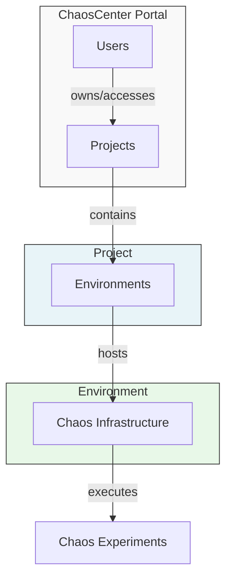
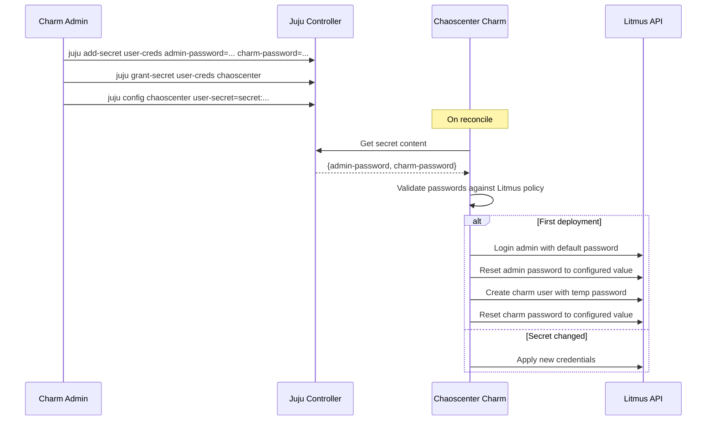
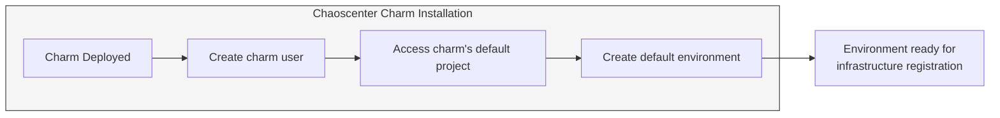
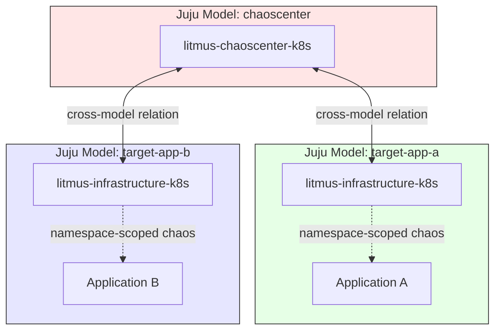
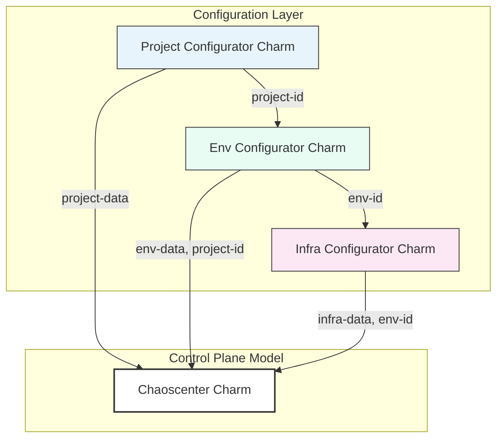

# Charmed LitmusChaos Resource Management

**Date:** 2026-03-16  
**Author:** Michael Dmitry (@michaeldmitry)

## Context and Problem Statement

[LitmusChaos](https://litmuschaos.io/) is a cloud-native chaos engineering platform that helps teams identify weaknesses in their Kubernetes infrastructure. The ChaosCenter is the web-based portal that orchestrates chaos experiments. It introduces several key abstractions for organizing chaos engineering workflows:

- **Users**: Portal-level accounts with Admin or non-admin roles that control access to the ChaosCenter.
- **Projects**: Logical separation of chaos infrastructures, experiments, and team configurations.
- **Environments**: Categorization layer (prod/non-prod) under which chaos infrastructures are created.
- **Chaos Infrastructure**: Services deployed in target environments that enable the Litmus control plane to inject chaos. Can be cluster-wide (targets all namespaces) or namespace-scoped.



When charming LitmusChaos for Juju, we must decide how these abstractions map to Juju's model of applications, relations, and secrets. The challenge is balancing:

1. **Simplicity**: A turnkey experience for users who just want chaos engineering working out of the box.
2. **Flexibility**: Support for advanced use cases with multiple environments and infrastructures.
3. **Security**: Proper credential management that integrates with Juju's secret system.
4. **Juju-native patterns**: Leveraging relations and models to naturally express the Litmus hierarchy.

## Decision

We adopt a phased approach: an initial simple design that provides immediate value, with a clear path to a more flexible configurator-based architecture.

### User Management

The charm manages two categories of accounts:

1. **Admin user**: The built-in Litmus admin account with full ChaosCenter access.
2. **Charm bot account**: A dedicated `charm` user for automated internal operations.

Credentials are managed via a Juju user secret that the charm administrator creates and grants to the chaoscenter application:

```yaml
# Secret contents (juju add-secret)
admin-password: <password meeting Litmus policy>
charm-password: <password meeting Litmus policy>
```



**Key behaviors:**

- Passwords must meet Litmus's strict policy: 8–16 characters, at least one digit, one lowercase, one uppercase, and one special character (`@$!%*?_&#`).
- On initial deployment, the charm resets the Litmus default admin password and creates the charm bot account.
- When the secret is updated, the charm validates and applies the new credentials.
- Credentials persist in the user secret, enabling re-deployment with the same database access.

### Environment Management

Upon chaoscenter charm installation, a **default environment** is automatically created:

- Created under the charm bot account's default project
- Uses default environment settings (non-prod type)
- Named to reflect its role as the charm-managed environment

This provides an immediate, functional setup without requiring manual environment configuration.



### Infrastructure Management

Chaos infrastructure is **always deployed in namespace-scoped mode**, not cluster-wide. This design choice aligns naturally with Juju's model-based architecture:

- The `litmus-infrastructure-k8s` charm acts as a **beacon** in its deployed model
- When integrated with chaoscenter via a Juju relation, it provisions chaos infrastructure scoped to that model's namespace
- Each Juju model maps to a Kubernetes namespace, providing natural isolation



**Rationale for namespace-scoped infrastructure:**

- **Juju alignment**: One infrastructure charm per model mirrors the Juju model = namespace paradigm.

### Future Architecture: Configurator Charms

To support advanced use cases requiring fine-grained control over projects, environments, and infrastructure, we plan to introduce **configurator charms**:



**Configurator charm responsibilities:**

| Charm | Purpose | Relation Data |
|-------|---------|---------------|
| Project Configurator | Define custom Litmus projects with specific settings | Project name, description, tags |
| Env Configurator | Create environments within projects | Environment type (prod/non-prod), project reference |
| Infra Configurator | Configure infrastructure registration parameters | Target model/namespace, Infra name, Infra Tags, environment reference |

This architecture enables:

- Multiple projects for organizational separation
- Custom environment configurations beyond the default
- Explicit control over infrastructure-to-environment mappings
- Potential future user management via dedicated configurator (e.g., LDAP/OIDC integration)

## Benefits

- **Turnkey experience**: Default environment and namespace-scoped infrastructure work immediately after deployment.
- **Security-first**: Credentials managed via Juju secrets; namespace isolation limits chaos scope.
- **Juju-native**: Cross-model relations and model-namespace mapping feel natural to Juju users.
- **Extensible**: Configurator charm pattern allows growth without breaking simple deployments.
- **Credential persistence**: User secret survives charm removal, enabling seamless re-deployment.

## Disadvantages

- **Limited initial flexibility**: Single default environment may not suit complex organizational needs initially.
- **Namespace-only**: Users requiring cluster-wide chaos experiments cannot use this charm directly.
- **Configurator complexity**: Future architecture adds operational overhead for advanced users.
- **Secret management**: Requires users to manually create and manage the user secret.

## Alternatives Considered


### Automatic Credential Generation

Generate and store credentials automatically without requiring a user-provided secret.

**Rejected because:**
- Credentials would be lost on charm removal, breaking database access on re-deploy
- Less transparent to operators who need to know/manage credentials

### Infrastructure Charm Drives Environment Creation

Allow the `litmus-infrastructure-k8s` charm to specify environment type (prod/non-prod) via config, and upon relation with chaoscenter, signal it to create an environment with that type for infrastructure registration.

**Rejected because:**
- Couples environment lifecycle to infrastructure charm deployment, violating separation of concerns
- Creates implicit environment creation that's harder to reason about and audit
- Environment-to-infrastructure is a one-to-many relationship; having infra create environments inverts this and could lead to duplicate environments
- Conflicts with the configurator charm pattern where the Env Configurator explicitly owns environment creation

